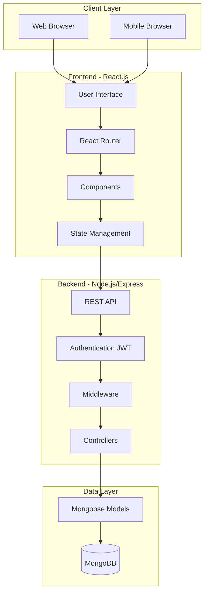
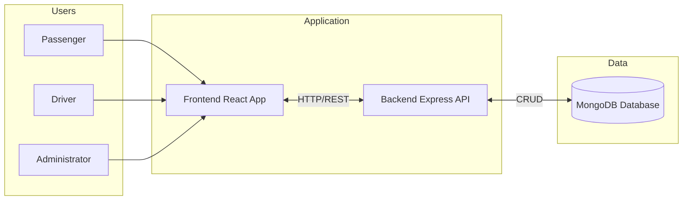
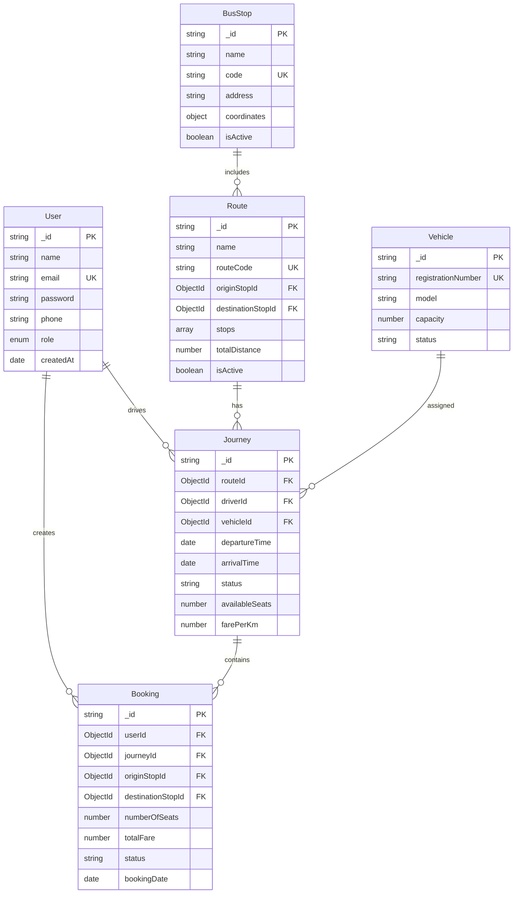
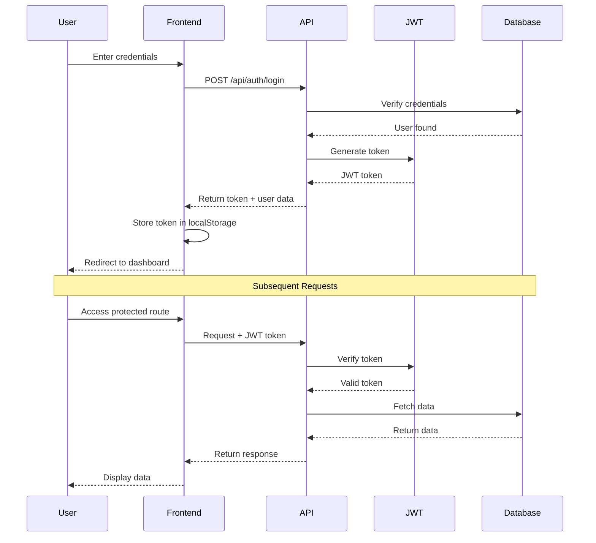
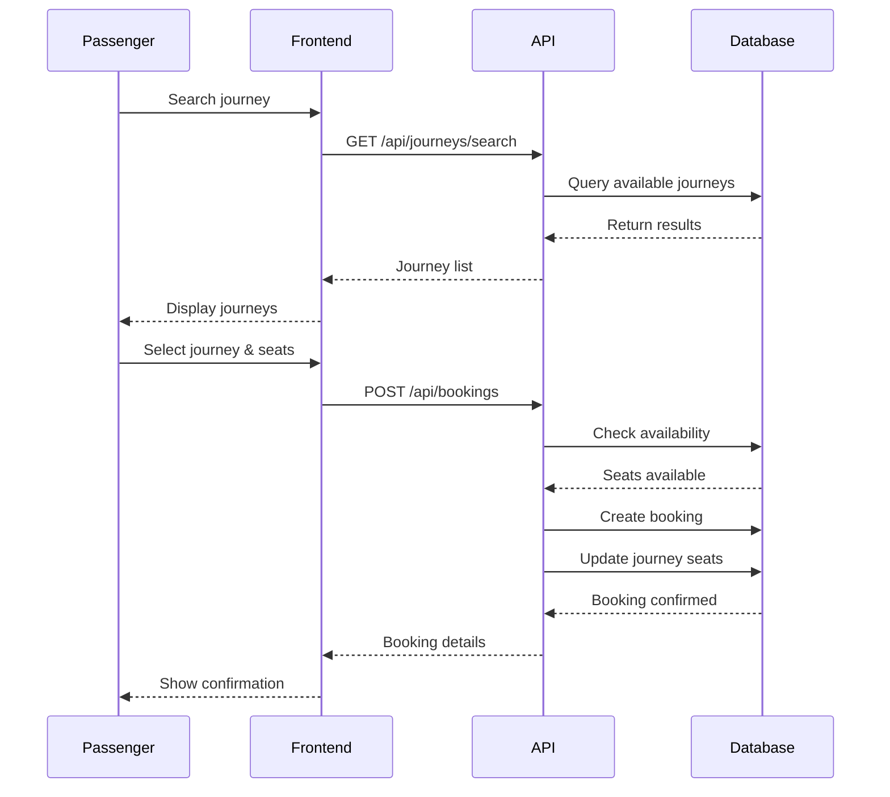
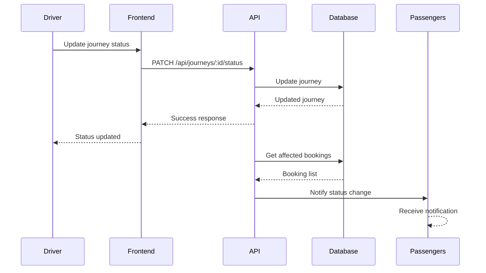
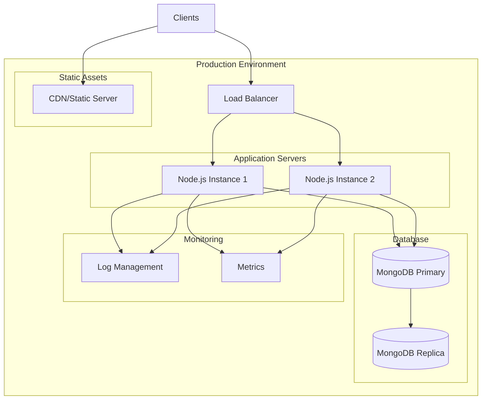
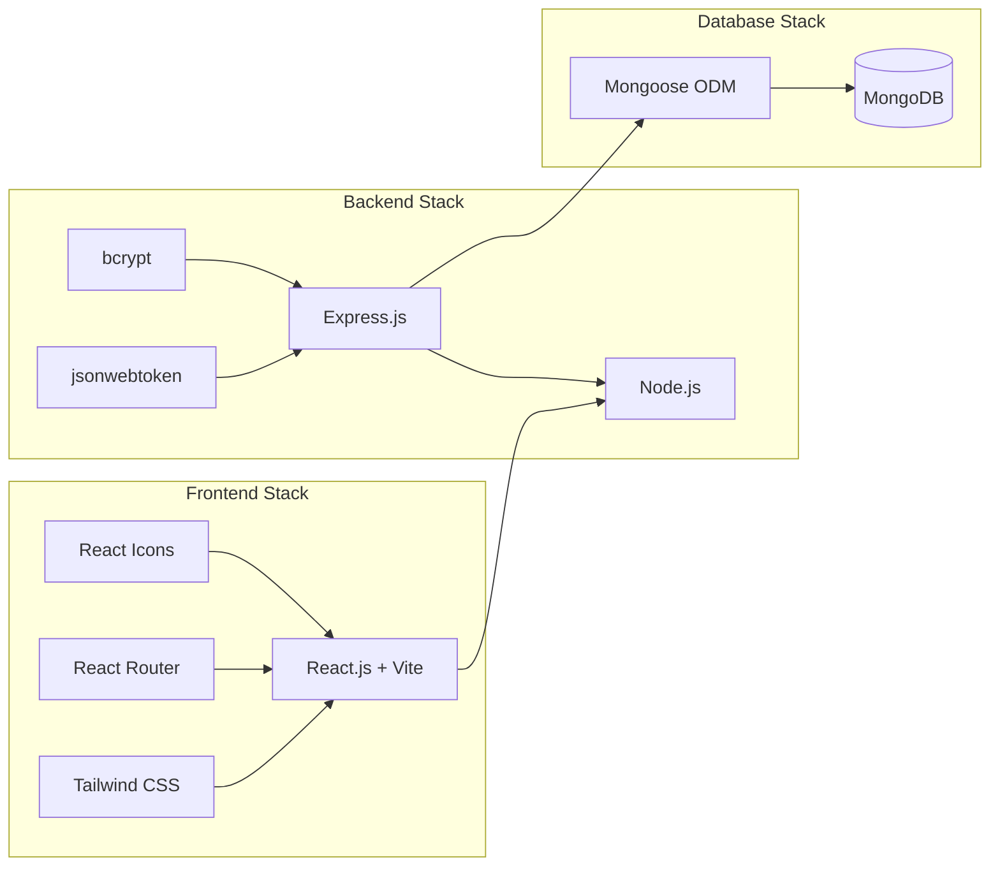

# 🏗️ Architecture Diagrams

## System Architecture Overview



## High-Level System Architecture



## Database Schema Architecture



## API Architecture

```mermaid
graph TB
    subgraph "API Endpoints"
        AUTH_EP[/api/auth]
        USER_EP[/api/users]
        ROUTE_EP[/api/routes]
        STOP_EP[/api/bus-stops]
        JOURNEY_EP[/api/journeys]
        BOOKING_EP[/api/bookings]
        VEHICLE_EP[/api/vehicles]
    end
    
    subgraph "Middleware"
        AUTH_MW[Authentication]
        ROLE_MW[Authorization]
        VALID_MW[Validation]
        ERROR_MW[Error Handler]
    end
    
    subgraph "Controllers"
        AUTH_CTRL[AuthController]
        USER_CTRL[UserController]
        ROUTE_CTRL[RouteController]
        STOP_CTRL[BusStopController]
        JOURNEY_CTRL[JourneyController]
        BOOKING_CTRL[BookingController]
        VEHICLE_CTRL[VehicleController]
    end
    
    AUTH_EP --> AUTH_MW
    USER_EP --> AUTH_MW
    ROUTE_EP --> AUTH_MW
    STOP_EP --> AUTH_MW
    JOURNEY_EP --> AUTH_MW
    BOOKING_EP --> AUTH_MW
    VEHICLE_EP --> AUTH_MW
    
    AUTH_MW --> ROLE_MW
    ROLE_MW --> VALID_MW
    VALID_MW --> AUTH_CTRL
    VALID_MW --> USER_CTRL
    VALID_MW --> ROUTE_CTRL
    VALID_MW --> STOP_CTRL
    VALID_MW --> JOURNEY_CTRL
    VALID_MW --> BOOKING_CTRL
    VALID_MW --> VEHICLE_CTRL
    
    AUTH_CTRL --> ERROR_MW
    USER_CTRL --> ERROR_MW
    ROUTE_CTRL --> ERROR_MW
    STOP_CTRL --> ERROR_MW
    JOURNEY_CTRL --> ERROR_MW
    BOOKING_CTRL --> ERROR_MW
    VEHICLE_CTRL --> ERROR_MW
```

## Component Architecture

```mermaid
graph TB
    subgraph "Passenger Components"
        P_DASH[Dashboard]
        P_SEARCH[Search Journey]
        P_BOOKING[Booking Form]
        P_HISTORY[Booking History]
    end
    
    subgraph "Driver Components"
        D_DASH[Dashboard]
        D_JOURNEY[Journey List]
        D_UPDATE[Update Status]
        D_DETAILS[Journey Details]
    end
    
    subgraph "Admin Components"
        A_DASH[Dashboard]
        A_ROUTE[Route Management]
        A_JOURNEY[Journey Management]
        A_STOP[Stop Management]
        A_VEHICLE[Vehicle Management]
        A_DRIVER[Driver Management]
    end
    
    subgraph "Shared Components"
        NAVBAR[Navigation Bar]
        FOOTER[Footer]
        MODAL[Modal]
        FORM[Form Components]
        CARD[Card Components]
    end
    
    P_DASH --> NAVBAR
    D_DASH --> NAVBAR
    A_DASH --> NAVBAR
    P_SEARCH --> FORM
    P_BOOKING --> FORM
    D_UPDATE --> FORM
    A_ROUTE --> FORM
```



## Authentication Flow



## Booking Flow



## Journey Status Update Flow



## Deployment Architecture



## Technology Stack Overview



---

**Note**: These diagrams use Mermaid syntax and will render properly on GitHub, GitLab, and any Markdown viewer that supports Mermaid diagrams.
